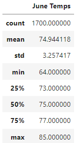
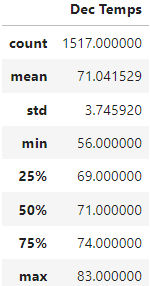
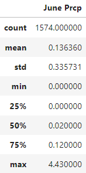
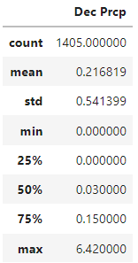
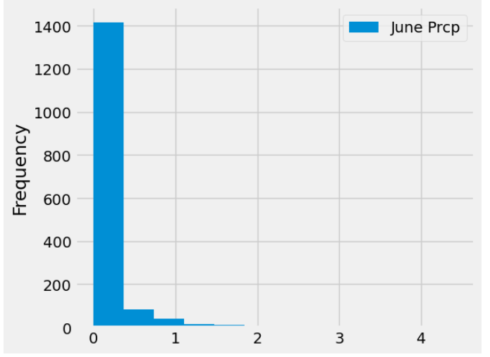

# Overview of the Analysis
The purpose of this challenge is to assist W. Avy with additional temperature trends before opening a surf shop.  He is particularly interested in focusing on data for the months of June and December in Oahu, which will help him to determine if a surf and ice cream shop business is sustainable year-round.  To complete this deliverable we will utilize the following tools:
Jupyter Notebook, VS Code, SQL Lite and Python.

## Analytics

### Analysis of June and December Temperature

Below are summary statics for the temperature during the months of June and December

 - The average temperature for the month of June was 75 degrees, with a min temperature of 64 and a max temperature of 85
 - The average temperature for the month of December was 71 degrees, with a min temperature of 56 and a max temperature of 83 
 - If W. Avy concludes that average temperatures above 70 degrees warrants surfing and ice cream, than this confirms the business could be sustainable year-round 

### Analysis of June and December Precipitation

In addition to studying the temperature trend, W. Avy wanted to check one more set of data, which includes also analyizing the precipitation for the months of June and December.

The reports yield the following:
 - The average precipitation for the month of June was 0.13 inches
 - The average precipitation for the month of December was 0.21 inches
 - The frequency for which rain accumulates above average is low

## Summary

In summary, W. Avy concludes that the average temperature and rainfall indicuates that Oahu would be a safe location to open a year-round surfing and ice cream business.
